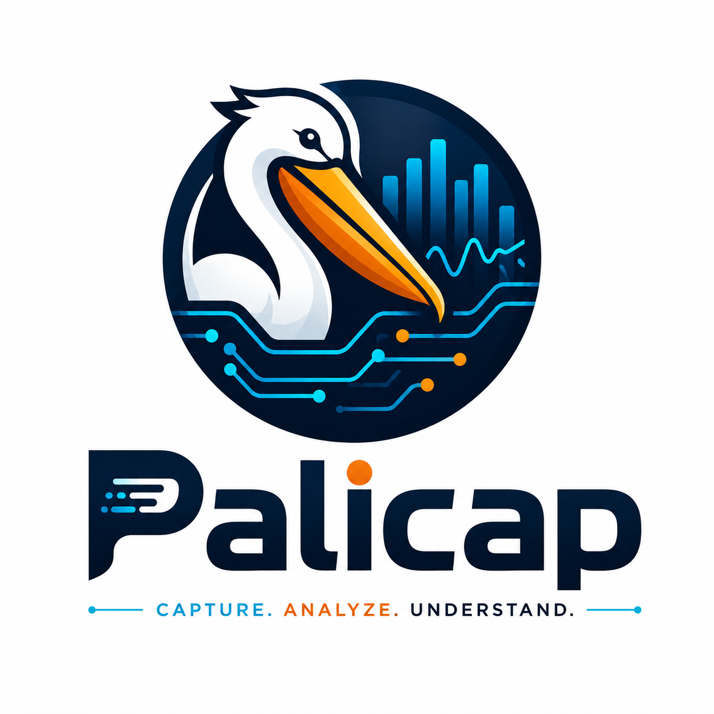

<div align="center">
  <h1>PeliCap: Network Traffic Intelligence Engine</h1>
  <p><b>An AI-powered network observability and troubleshooting platform.</b></p>
</div>
<br>
<div align="center">
  
</div>

<div align="center">Made with ❤️ by Harshita Patidar</div>

---

## 💡 The Idea
Traditional packet analyzers like Wireshark require deep networking expertise. When an API is slow, engineers are forced to capture packets, apply complex filters, and manually correlate TCP, DNS, and TLS data. **PeliCap (Network Copilot)** changes this paradigm. 

Instead of treating packet capture as the end goal, PeliCap uses it as a data source. It combines packet capture, protocol analysis, flow reconstruction, and anomaly detection into a single observability platform, topped with an AI assistant. You don't have to manually dissect thousands of packets anymore; you can simply ask the AI, *"Why is my API slow?"* and receive a detailed root-cause analysis.

## 🎯 Use Cases
PeliCap is designed to serve a wide range of users, from networking experts to students:

1. **Backend Developers**
   - *Question:* "Why is service A taking 3 seconds to respond?"
   - *Use Case:* Instantly find out if the latency is due to DNS resolution, TCP retransmissions, or application logic.
2. **DevOps / SRE Engineers**
   - *Question:* "Which service is generating the most traffic right now?"
   - *Use Case:* Identify bandwidth hogs, detect traffic spikes, and monitor active flows in real-time.
3. **System Administrators**
   - *Question:* "Are there any suspicious connections or port scans?"
   - *Use Case:* Automatically detect long-lived connections, port scans, and unexpected traffic anomalies.
4. **Students Learning Networks**
   - *Question:* "Explain what happened during this TCP connection."
   - *Use Case:* Use the AI's "Learning Mode" to interactively learn about TCP handshakes, TLS, and network protocols by examining real traffic.

## 🚀 How PeliCap is Helpful
- **Answers Over Packets:** Translates raw bytes into human-readable insights.
- **Root Cause Analysis (RCA):** Automatically correlates metrics (e.g., DNS latency, packet loss, TLS handshake times) to pinpoint the source of issues.
- **Automated Anomaly Detection:** Real-time alerts for TCP retransmissions, DNS delays, TLS bottlenecks, and traffic spikes.
- **Flow-centric View:** Groups packets into meaningful conversations (flows) rather than isolated, millions of packets.
- **Natural Language Querying:** Ask plain English questions about your network traffic.

## 🏗️ High-Level Architecture
PeliCap follows a layered architecture, starting from raw packet capture up to an AI Copilot layer.

```mermaid
flowchart TD
    %% Define Styles
    classDef hardware fill:#2d3436,stroke:#b2bec3,stroke-width:2px,color:#dfe6e9
    classDef core fill:#0984e3,stroke:#74b9ff,stroke-width:2px,color:#fff
    classDef db fill:#00b894,stroke:#55efc4,stroke-width:2px,color:#fff
    classDef ai fill:#6c5ce7,stroke:#a29bfe,stroke-width:2px,color:#fff
    classDef ui fill:#e17055,stroke:#fab1a0,stroke-width:2px,color:#fff

    %% Components
    NIC["📡 Network Interface (eth0, wlan0)"]:::hardware
    PCAP["🗂️ PCAP File"]:::hardware

    subgraph CoreEngine["⚙️ C++ Core Processing Engine"]
        Capture["📥 Module 1: Capture Engine (PcapPlusPlus)"]:::core
        Bus["🚏 SPSC PacketBus (Lock-Free Queue)"]:::core
        Dissector["🔍 Module 2: Dissector Engine (Stateless)"]:::core
        Flow["🌊 Module 3: Flow Reconstruction (absl::flat_hash_map)"]:::core
        Metrics["📊 Module 4 & 5: Metrics & Detection Engine"]:::core
        StorageEng["💾 Module 6: Storage Engine (Batch Writer)"]:::core
    end

    subgraph DataLayer["🗄️ Persistence Layer"]
        TimescaleDB[("🐘 TimescaleDB (PostgreSQL)")]:::db
        DiskPCAP["📁 Truncated PCAP on Disk"]:::db
    end

    subgraph IntelligenceLayer["🧠 Intelligence & UI Layer"]
        FastAPI["🐍 Python Backend (FastAPI)"]:::ai
        Groq["🤖 LLM / AI Copilot (Groq API)"]:::ai
        React["💻 React Frontend (Vite, Recharts)"]:::ui
    end

    %% Flow
    NIC -->|Promiscuous Sniff| Capture
    PCAP -->|Load File| Capture
    
    Capture -->|Raw Bytes| Bus
    Bus -->|CapturedPacket| Dissector
    Bus -->|Truncated Packet (96 bytes)| StorageEng
    
    Dissector -->|ParsedPacket (L2-L7)| Flow
    Flow -->|Flow State (5-tuple)| Metrics
    
    Flow -.->|FLOW_CLOSED Event| StorageEng
    Metrics -.->|Alerts & Metrics| StorageEng
    
    StorageEng -->|Bulk Insert via libpqxx| TimescaleDB
    StorageEng -->|Write| DiskPCAP
    
    TimescaleDB <-->|Query Flows & Metrics| FastAPI
    FastAPI <-->|RAG Context| Groq
    FastAPI <-->|REST API| React
```

## ⚙️ The Pipeline & Module Architecture

### 1. Packet Capture Engine
- **Purpose:** Capture all packets exactly as they appear on the wire from live interfaces (e.g., `eth0`, `docker0`) or uploaded `.pcap` files.
- **Architecture:** Built in **C++** using `PcapPlusPlus`. It employs an asynchronous thread to capture packets and dispatches them into a lock-free Single-Producer Single-Consumer (SPSC) `PacketBus` queue using `boost::lockfree`, ensuring zero dropped packets during traffic spikes.

### 2. Protocol Dissector Engine
- **Purpose:** Convert raw bytes into meaningful protocol fields. We only parse what the analytics engine needs, avoiding the bloat of thousands of dissectors.
- **Architecture:** A 100% stateless and thread-safe engine. It walks the OSI model (L2 to L7) extracting fields for Ethernet, IPv4, TCP, UDP, DNS, HTTP, and TLS. It safely builds a `ParsedPacket` struct using Return Value Optimization (RVO) without throwing C++ exceptions.

### 3. Flow Reconstruction Engine
- **Purpose:** Transform isolated packets into meaningful conversations (flows). Real engineers analyze flows, not individual packets.
- **Architecture:** Uses a high-performance hash map (`absl::flat_hash_map`) for CPU cache locality. It groups packets based on a 5-tuple flow key, tracks TCP state (SYN, ACK, FIN), calculates bidirectional bytes, and fires a pub/sub `FLOW_CLOSED` event for downstream storage.

### 4. Metrics & Detection Engine
- **Purpose:** Generate useful statistics and automatically identify problems.
- **Architecture:** 
  - **Metrics Engine:** Calculates bandwidth, throughput, RTT, retransmissions, average DNS resolution time, and latency distributions.
  - **Detection Engine:** Constantly evaluates rules on the metrics (e.g., repeated sequence numbers = packet loss, sudden traffic increase = anomaly) and generates alerts.

### 5. Storage Layer
- **Purpose:** Efficiently store flows, metrics, alerts, and truncated `.pcap` files for deep forensics.
- **Architecture:** 
  - **Database:** Powered by **TimescaleDB** using automatic background migrations. A C++ background `BatchWriter` buffers thousands of flow records and uses `libpqxx`'s `stream_to` for hyper-fast bulk insertions.
  - **Disk Storage:** Raw packets are truncated to 96 bytes (keeping only headers) and written to rolling `.pcap` files, dramatically reducing disk usage while preserving forensic data.

### 6. AI Copilot (The Intelligence Layer)
- **Purpose:** Translate networking data into human language, provide automated root cause analysis, and assist in interactive troubleshooting.
- **Architecture:** A **Python (FastAPI)** service powered by an LLM (via Groq API). It uses a Retrieval-Augmented Generation (RAG) approach to ensure the LLM only receives summarized context (metrics, alerts) and never raw PCAP data.
- **Key AI Features:**
  - **Natural Language Queries:** Users can ask questions like, *"Which host uses the most bandwidth?"* and get precise answers based on real-time metrics.
  - **Packet & Flow Explanation:** Click on a packet or a flow, and the AI translates it into plain English (e.g., *"This packet starts the TCP three-way handshake..."*).
  - **Root Cause Analysis (RCA):** The AI correlates multiple metrics (e.g., DNS latency + packet loss + TLS handshake) to pinpoint the exact bottleneck.
  - **Learning Mode:** Designed for students and beginners to interactively ask questions about networking concepts tied to real traffic.

### 7. Automated Reporting System
- **Purpose:** Generate comprehensive, shareable summaries and incident reports for stakeholders or post-mortem analysis.
- **Architecture:** The Python backend utilizes libraries like **WeasyPrint** and **Matplotlib** to render complex metrics and AI insights into documents.
- **Report Types:** 
  - Traffic Summary, DNS Report, HTTP Report, Security Report, and full Root Cause Analysis Reports.
- **Exports:** Reports can be exported as **PDF, Markdown, or JSON**.

### 8. Visualization Dashboard
- **Purpose:** Provide a unified interface for experts and novices.
- **Architecture:** A modern **React** frontend using Vite and Recharts. Features include:
  - Dashboard Overview (Bandwidth, Alerts)
  - Flow Explorer (Timeline, Flow Statistics)
  - Natural Language Chat Interface for the AI Copilot
  - DNS/HTTP Analytics Pages

## 🛠️ Tech Stack
- **Core Engine & Capture:** C++, `libpcap`, `nlohmann/json`
- **Backend API:** C++ (Drogon/Crow)
- **AI Service:** Python, FastAPI, Groq LLM API
- **Database:** PostgreSQL (TimescaleDB)
- **Frontend:** React, TypeScript, Recharts
- **Deployment:** Docker & Docker Compose
